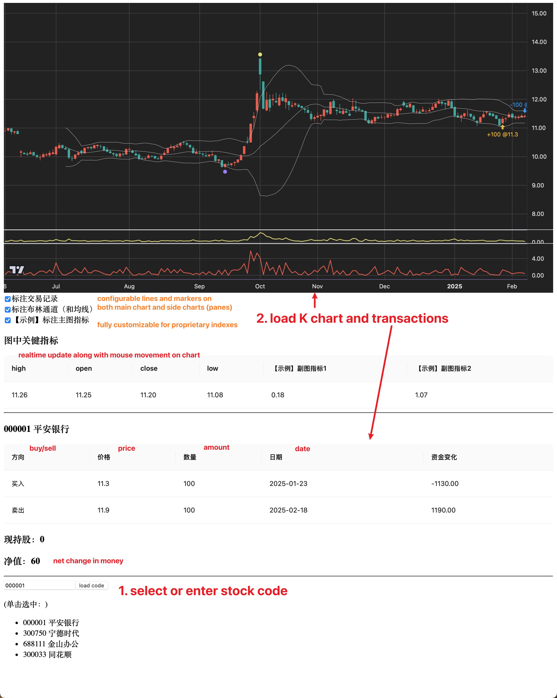

## Introduction



This project runs tradingview locally on your own data, it
- provides basic intuitive operations on a chart such as dragging, zooming in both chart and axis
- supports indexes in main chart such as BOLL, MA, etc
- supports adding markers along with K-Candles, for example this project adds markers for each historical transactions
- you may have as many customizable side chart (panes) as you need
- each indexes, markers and side chart is solely configurable and on/off on the spot
- data/digits in the chart is retrievable for further integrated calculations
- there's no assumption in data. Any trade targets is usable that you'll have to provide it by your own efforts
- this project integrated trade data with trade transactions, which I find it at ease

---

Motivation:

This project is not intended for a integration of common trade indexes whatsoever. There's plenty of platforms out there, either for free or premium. [TradingView](https://www.tradingview.com) itself is great.

This project serves as a starting point for those who:
- would like to develop proprietary trade indexes on their own, or for their own
- would like to develop a trade system of their own based on indexes try-out or experiment
- regards visualization of great value
- regards rapid prototyping and iteration of great value
- or, someone who just needs an it-just-work project to try-out tradingview on their own data

## What there is not

There is no data.

This project does not assume on the trade target itself, whether it's candle data for day or for 5-min, or it's not for stocks.

This project only comes with example data from four China stock in the recent year, and some mock transaction data for them.

For myself, I use [证券宝](http://baostock.com/baostock/index.php/首页) , which is free, to update China stocks everyday.

You'll have to provide data into `server/app/data/xxx.csv` by your own efforts. Refer to `server/app/api/api_stock.py` for formats (dead simple).

## How to run

backend:

```
cd server/app
pip install -r requirements.txt # gunicorn, flask, loguru, pandas
chmod +x wsgi.sh
./wsgi.sh
```

frontend：

```
cd client/src
npm install # install, first time only
npm start
```

## DEVELOPMENT

Based on [tradingview](https://github.com/tradingview/lightweight-charts)

This project is pretty much a flask-backed wrapper for tradingview-react rapid prototyping on your own real data.

You may try out any examples in [Official Documentation](https://tradingview.github.io/lightweight-charts/tutorials/how_to/price-line) in `client/src/tradingview_chart.jsx` for rapid prototyping, testouts and experiments.

Stack：
- frontend
    - react
    - parcel
    - antd（Table）
- backend
    - gunicorn
    - flask
    - pandas

issue and PR are welcomed.

## License

```
MIT License

Copyright (c) 2025 Oliver Xu

Permission is hereby granted, free of charge, to any person obtaining a copy
of this software and associated documentation files (the "Software"), to deal
in the Software without restriction, including without limitation the rights
to use, copy, modify, merge, publish, distribute, sublicense, and/or sell
copies of the Software, and to permit persons to whom the Software is
furnished to do so, subject to the following conditions:

The above copyright notice and this permission notice shall be included in all
copies or substantial portions of the Software.

THE SOFTWARE IS PROVIDED "AS IS", WITHOUT WARRANTY OF ANY KIND, EXPRESS OR
IMPLIED, INCLUDING BUT NOT LIMITED TO THE WARRANTIES OF MERCHANTABILITY,
FITNESS FOR A PARTICULAR PURPOSE AND NONINFRINGEMENT. IN NO EVENT SHALL THE
AUTHORS OR COPYRIGHT HOLDERS BE LIABLE FOR ANY CLAIM, DAMAGES OR OTHER
LIABILITY, WHETHER IN AN ACTION OF CONTRACT, TORT OR OTHERWISE, ARISING FROM,
OUT OF OR IN CONNECTION WITH THE SOFTWARE OR THE USE OR OTHER DEALINGS IN THE
SOFTWARE.
```
