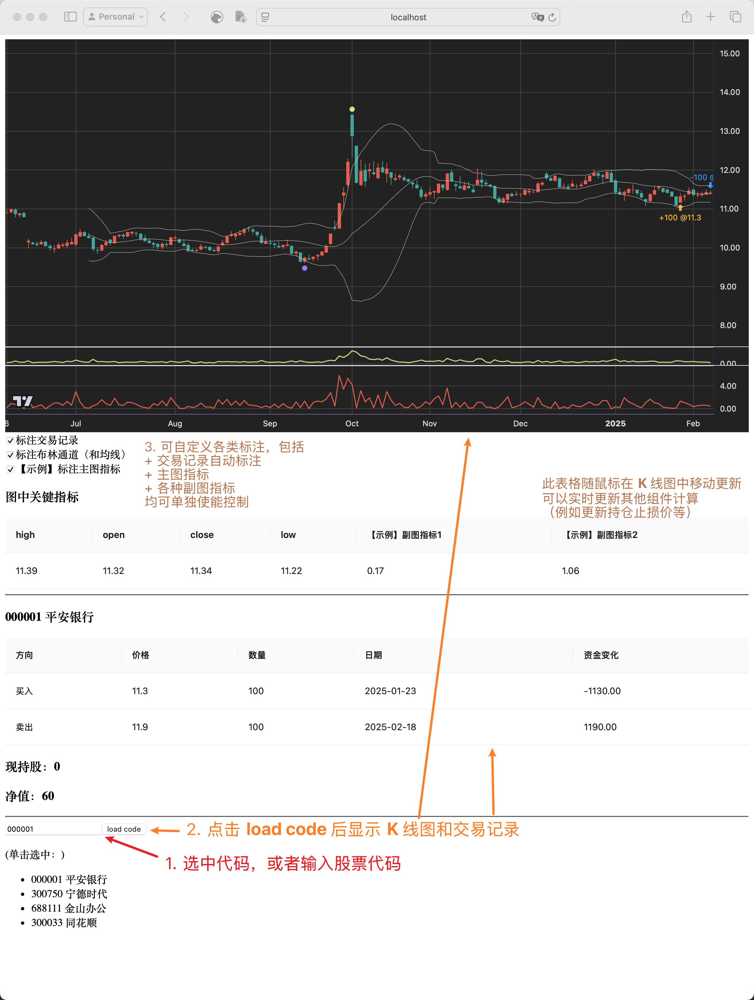

## 介绍




本项目搭建了一个完全在本地部署的 tradingview K 线图，

- 支持拖拽、放大缩小、轴向放大等基本操作
- 支持均线、布林通道等线形的主图指标
- 支持 K 线上下方标注
- 支持任意副图配置，和自定义副图指标计算
- 支持各类标注指标单独开关、配置
- 支持从 tradingview 组件中获取数值（包括价格、K 线、对应自定义指标结果），可再用于其他计算（如持仓止损等）
- 支持自定义数据来源，可轻松适配不同的交易标的和数据来源
- 支持显示交易记录


---


本项目不包含众多常见的技术指标。这类指标无论用哪个券商平台都能开箱即用，属于重复开发、浪费资源。本项目主要的动机和目标是：

- 需要自行开发、验证私有指标
- 需要图表化显示
- 需要开发私有的交易系统
- 需要快速迭代、快速编码、所见即所得


---


本项目不包含 A 股数据源，不限制用户的交易粒度（日 K 、 5 分 K等），也不假定用户的交易标的。因此，用户需要自行准备交易标的的历史数据，并更新 `server/app/data/xxx.csv`。

对于 A 股，本人使用 [证券宝](http://baostock.com/baostock/index.php/首页) 每日免费获取最新数据，此处无广，用户也欢迎自行使用其他的数据来源。

项目代码中仅包含图中四只股票的一年的日 K 数据，以及模拟交易记录。

## 如何运行

启动后端服务器：

```
cd server/app
pip install -r requirements.txt # gunicorn, flask, loguru, pandas
chmod +x wsgi.sh
./wsgi.sh
```

启动前端：

```
cd client/src
npm install # 仅初次安装
npm start
```

## DEVELOPMENT

基于 [tradingview](https://github.com/tradingview/lightweight-charts)
[此处官方教程](https://tradingview.github.io/lightweight-charts/tutorials/how_to/price-line)的各项示例，都可以在 `client/src/tradingview_chart.jsx` 中快速试验

技术栈：
- 前端
    - react
    - parcel
    - antd（Table）
- 后端
    - gunicorn
    - flask
    - pandas

欢迎 issue 和 PR
